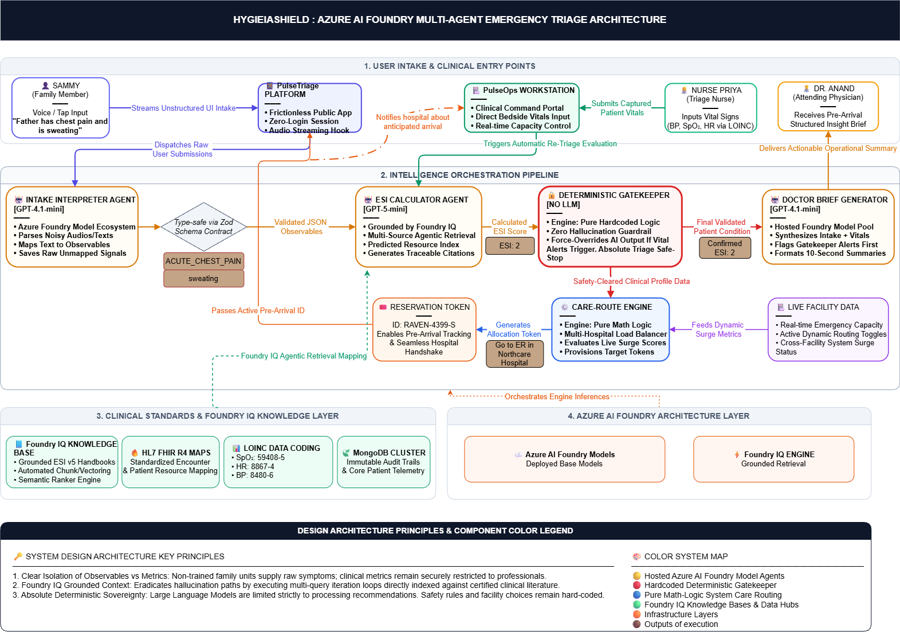

- [Project HygieiaShield](#project-hygieiashield)
  - [AI-Powered Multi-Agent Emergency Triage and Care Orchestration Ecosystem](#ai-powered-multi-agent-emergency-triage-and-care-orchestration-ecosystem)
- [The Problem](#the-problem)
  - [Why Existing Solutions Fall Short](#why-existing-solutions-fall-short)
- [The Solution](#the-solution)
- [The Ecosystem](#the-ecosystem)
  - [PulseTriage](#pulsetriage)
    - [Key Capabilities](#key-capabilities)
  - [PulseOps](#pulseops)
    - [Key Capabilities](#key-capabilities-1)
      - [Clinical Workstation](#clinical-workstation)
      - [Operations Command Center](#operations-command-center)
- [One Night. Four Users. One Continuous Journey.](#one-night-four-users-one-continuous-journey)
  - [1. Sammy — The Family Member](#1-sammy--the-family-member)
  - [2. Nurse Priya — The Triage Nurse](#2-nurse-priya--the-triage-nurse)
  - [3. Hospital Operations Coordinator](#3-hospital-operations-coordinator)
  - [4. Dr. Anand — The Attending Physician](#4-dr-anand--the-attending-physician)
- [The Outcome](#the-outcome)
- [Why The Architecture Is Different](#why-the-architecture-is-different)
  - [Mistake #1](#mistake-1)
  - [Mistake #2](#mistake-2)
  - [Principle 1: Separate Observables from Clinical Metrics](#principle-1-separate-observables-from-clinical-metrics)
    - [Why This Matters](#why-this-matters)
  - [Principle 2: Asymmetric AI Architecture](#principle-2-asymmetric-ai-architecture)
    - [Intake Interpreter](#intake-interpreter)
    - [ESI Calculator Agent](#esi-calculator-agent)
    - [Deterministic Gatekeeper Agent](#deterministic-gatekeeper-agent)
    - [Care-Route Engine](#care-route-engine)
    - [Doctor Brief Generator](#doctor-brief-generator)
  - [Human Decisions. Machine Assistance.](#human-decisions-machine-assistance)
  - [Architecture Diagram](#architecture-diagram)
- [Technology Stack](#technology-stack)
  - [AI \& Agent Layer](#ai--agent-layer)
  - [Backend \& Frontend](#backend--frontend)
  - [Data \& Standards](#data--standards)
  - [Cloud Infrastructure](#cloud-infrastructure)
  - [Products](#products)
- [Clinical Standards](#clinical-standards)
  - [Emergency Severity Index (ESI v5)](#emergency-severity-index-esi-v5)
  - [HL7 FHIR R4](#hl7-fhir-r4)
  - [LOINC](#loinc)
- [Vision](#vision)

# Project HygieiaShield

### AI-Powered Multi-Agent Emergency Triage and Care Orchestration Ecosystem

> **From panic to preparedness.**
>
> HygieiaShield transforms emergency care from a reactive process into a coordinated, pre-arrival intelligence system—ensuring patients reach the right facility while care teams are prepared before they walk through the door.

---

# The Problem

During local medical emergencies or public health surges, healthcare systems often fail at the intersection of **human panic** and **systemic data friction**.

When an emergency occurs:

- Citizens rush to the nearest Emergency Room regardless of severity.
- Mild and moderate cases overwhelm already strained facilities.
- Critical patients arrive unaware of long wait times and capacity constraints.
- Hospital staff operate across fragmented systems with limited visibility into incoming demand.
- Administrative bottlenecks slow triage and treatment during the moments that matter most.

The result is not necessarily a shortage of care.

It is a **failure of information flow** at exactly the moment people are least capable of handling friction.

### Why Existing Solutions Fall Short

Most healthcare software unintentionally increases friction by requiring:

- Account creation
- Lengthy form completion
- Structured medical knowledge from untrained civilians

Many emerging solutions also rely on unconstrained AI outputs, introducing hallucination risks into safety-critical workflows where reliability is non-negotiable.

---

# The Solution

HygieiaShield is an **AI-powered, multi-agent emergency triage and care orchestration ecosystem** that transforms unstructured symptom reports into clinically grounded emergency workflows—connecting a family's living room directly to the right clinical facility before they ever leave home.

The platform is designed to:

- Capture symptoms through frictionless voice-first and tap-based intake
- Convert unstructured observations into structured clinical data
- Determine patient acuity using the Emergency Severity Index (ESI v5)
- Route patients to the most appropriate facility—not simply the nearest one
- Provide hospitals with pre-arrival patient visibility
- Enable re-triage using clinician-recorded vitals
- Generate structured physician handoff briefs in seconds
- Reduce emergency department overcrowding through intelligent load balancing
- Enable proactive surge detection and operational coordination

Unlike traditional healthcare applications that rely on a single AI model, HygieiaShield employs a specialized multi-agent architecture where each agent performs a narrowly scoped clinical or operational responsibility under deterministic safety supervision.

---

# The Ecosystem

## PulseTriage

A **public-facing anti-anxiety emergency intake experience** designed for accessibility, speed, and zero-friction reporting.

### Key Capabilities

- No account creation
- No forms
- No medical expertise required
- Voice-first symptom reporting
- Structured symptom capture from natural language
- Pre-arrival acuity assessment
- Intelligent care routing

---

## PulseOps

A clinical operations platform designed for emergency departments and hospital coordinators.

### Key Capabilities

#### Clinical Workstation

- Patient recall via reservation token
- Pre-arrival encounter visibility
- Vital-sign capture
- Automated re-triage AI workflows
- AI-assisted physician briefing

#### Operations Command Center

- Real-time capacity monitoring
- Surge detection
- Facility routing controls
- Operational visibility across incoming demand

---

# One Night. Four Users. One Continuous Journey.

## 1. Sammy — The Family Member

Sammy's father Jim experiences acute chest pain.

Sammy opens **PulseTriage**.

- Two symptom selections
- Four seconds of voice input, "Oh my god, my father is having chest pain"
- No forms
- No login

The system determines the likely acuity level to be High Risk (ESI Level 2) and routes Jim to **Northcare Hospital** instead of the overcrowded **St. Mary's Emergency Department**.

A reservation token is generated:

`RAVEN-4399-S`

Before Jim leaves home, the hospital already knows he is coming.

---

## 2. Nurse Priya — The Triage Nurse

Upon arrival, Nurse Priya retrieves the encounter using the reservation token.

She immediately sees:

- Pre-arrival symptom observations
- Structured intake information

She records Jim's vital signs.

A re-triage workflow executes automatically.

Within seconds:

- Acuity is recalculated
- Safety thresholds are evaluated
- Critical abnormalities are flagged by the Deterministic Gatekeeper

No re-entry.
No repeated questioning.
No lost information.

---

## 3. Hospital Operations Coordinator

As patient volume increases:

- Surge scores update in real time
- Capacity trends become visible
- Routing controls can be adjusted proactively

No phone calls.

No spreadsheets.

No guesswork.

---

## 4. Dr. Anand — The Attending Physician

Before entering the room, Dr. Anand receives a structured AI generated physician brief containing:

- Reported symptoms
- Recorded vital signs
- Clinical observations
- Triage outputs
- Safety alerts

The summary takes less than ten seconds to review.

Crucial time is saved before the first clinical interaction begins.

---

# The Outcome

Two products.

One continuous transaction.

A journey that begins in a living room and ends in the right clinical hands—with:

- Complete auditability
- Grounded clinical reasoning with reduced LLM hallucinations
- Minimal intake friction
- Coordinated operational awareness
- Traceable decision-making

---

# Why The Architecture Is Different

Most healthcare AI systems make one of two mistakes:

### Mistake #1

They add friction during the moment users are least capable of handling it.

### Mistake #2

They place unconstrained AI inside safety-critical decision paths where hallucinations are unacceptable.

**HygieiaShield does neither.**

---

## Principle 1: Separate Observables from Clinical Metrics

Patients and families report what they can reliably observe.

Examples:

- Chest pain
- Difficulty breathing
- Bluish lips
- Confusion
- Dizziness

They are **never asked** to provide measurements they cannot accurately know, such as:

- Blood pressure
- Oxygen saturation
- Heart rate

Clinical metrics are collected only by trained medical professionals using appropriate equipment.

#### Why This Matters

By separating human observations from clinician-measured vitals, HygieiaShield:

- Keeps emergency intake simple enough for panicked family members
- Prevents inaccurate self-reported medical measurements from entering the system
- Preserves the integrity of downstream triage decisions
- Ensures clinical assessments are based on appropriately collected data

---

## Principle 2: Asymmetric AI Architecture

Each component performs a narrowly defined role.

#### Intake Interpreter

**Model:** Azure OpenAI Model GPT-4.1-mini

**Purpose:**

- Converts natural language into structured clinical observables and captures any unmapped patient symptoms which might be beneficial for triaging and recording
- Handles noisy, emotional, unstructured user input

---

### ESI Calculator Agent

**Model:** Azure OpenAI Model GPT-5-mini

**Purpose:**

- Evaluates structured patient observations against the Emergency Severity Index (ESI v5) framework
- Determines key triage indicators, including:
  - Need for immediate life-saving intervention
  - Presence of high-risk conditions
  - Predicted resource utilization
  - ESI acuity level (1–5)
- Uses Azure AI Foundry's grounded retrieval pipeline to reason against the ESI v5 handbook rather than relying on unconstrained model inference
- Produces citations and groundedness evidence supporting every acuity assessment

---

### Deterministic Gatekeeper Agent

**Model:** None (Pure Deterministic Logic)

**Purpose:**

- Acts as the **final safety authority** within the triage pipeline
- Validates all AI-generated outputs against predefined clinical thresholds and safety rules
- Evaluates clinician-recorded vital signs using deterministic mathematical logic
- Detects critical conditions that require escalation regardless of AI recommendations
- Prevents unsafe routing or acuity assignments caused by model error, incomplete information, or hallucination

Unlike the AI agents, the Deterministic Gatekeeper does not interpret, infer, or generate content.

It applies fixed clinical rules that produce identical outputs for identical inputs every time.

If an AI-generated assessment conflicts with a deterministic safety rule, the Gatekeeper overrides the AI output and enforces the safer clinical pathway.

**In HygieiaShield, AI recommends. The Gatekeeper decides.**

---

### Care-Route Engine

**Model:** None (Pure Deterministic Logic)

**Purpose:**

- Routes patients to the right facility—not simply the nearest one
- Combines patient acuity, capacity, and operational status to determine the optimal destination
- Dynamically balances demand across healthcare facilities during local surges
- Manages the complete reservation lifecycle from intake to arrival
- Powers hospital-level routing controls and surge-response workflows

The Care-Route Engine serves as the operational brain of HygieiaShield, transforming isolated hospitals into a coordinated emergency care network.

All routing decisions are deterministic, auditable, and independent of AI-generated outputs.

---

### Doctor Brief Generator

**Model:** Azure OpenAI GPT-4.1-mini

**Purpose:**

- Produces a structured physician-ready brief from pre-arrival observations, bedside vitals, triage assessments, and safety alerts
- Surfaces the most clinically relevant information first, reducing information overload during high-pressure situations
- Provides rapid situational awareness before the physician enters the room
- Reduces administrative review time and unnecessary back-and-forth between care teams
- Helps clinicians focus on decision-making rather than information gathering

The Doctor Brief Generator acts as the final intelligence layer in the patient journey—transforming fragmented intake and triage data into an actionable clinical narrative within seconds.

---

## Human Decisions. Machine Assistance.

AI is allowed to:

- Extract information
- Organize information
- Ground information against published standards

AI is **not** allowed to:

- Override vital-sign thresholds
- Assign deterministic risk flags
- Execute operational capacity controls
- Bypass safety rules

Those responsibilities belong to deterministic systems that produce identical outputs for identical inputs—every time.

---

## Architecture Diagram

---

# Technology Stack

### AI & Agent Layer

- Azure OpenAI GPT-4.1-mini — Intake Interpreter Agent
- Azure OpenAI GPT-5-mini — ESI Calculator Agent
- Azure AI Foundry Knowledge & Retrieval — Grounded ESI v5 reasoning

### Backend & Frontend

- Next.js 15
- TypeScript
- Node.js
- RESTful APIs
- Zod — Runtime schema validation and type-safe agent contracts

### Data & Standards

- MongoDB

### Cloud Infrastructure

- Azure AI Foundry
- Azure OpenAI Service

### Products

- PulseTriage — Public Emergency Intake Platform
- PulseOps — Clinical Operations & Command Center

---

# Clinical Standards

This system is built on real-world emergency medicine standards.

### Emergency Severity Index (ESI v5)

- Industry-standard emergency triage framework used across modern emergency departments
- Serves as the triage foundation for acuity assessment

### HL7 FHIR R4

- All encounter transitions map to valid FHIR resources
- Standards-compliant patient state management

### LOINC

Standardized coding for clinical measurements, including:

- SpO₂ — 59408-5
- Heart Rate — 8867-4
- Blood Pressure — 8480-6

---

# Vision

**The future of emergency care is not faster hospitals.**

It is hospitals that are already prepared before the patient arrives.

**That is Project HygieiaShield.**
